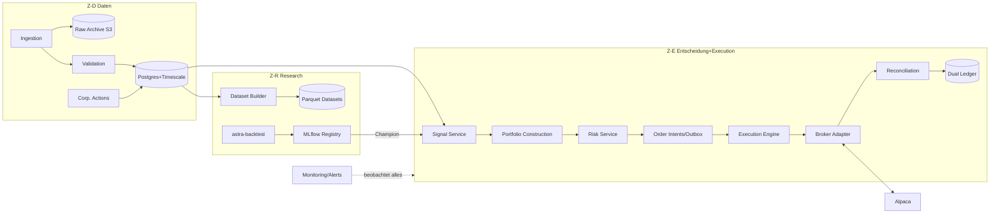
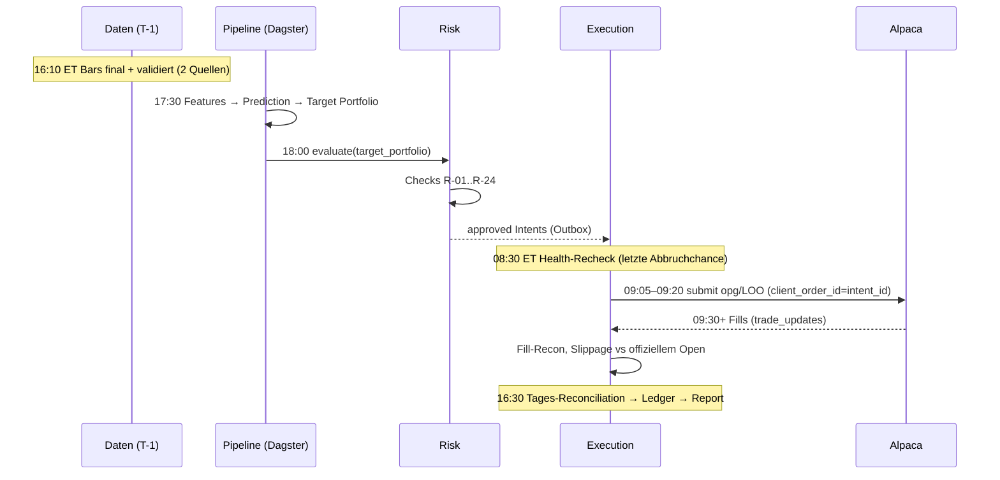

# 01 — Executive Summary und finale Architektur (PHASE 8)

Zurück: [[00_HOME]]

## 1. Was ASTRATRADE ist

Ein reproduzierbares, auditierbares Research- und Trading-System für US-ETFs mit drei
getrennten Tracks (A: SPY/BIL-Exposure — primär; B: Sektorrotation; C: Multi-Asset),
täglicher Entscheidungsfrequenz und Ausführung in der Opening Auction (Whole Shares,
Alpaca `opg`). Der Weg zu Live-Kapital führt zwingend über formale Gates:
Research → Validation → Paper → Shadow → Controlled Live → Scale-up.

**Ehrlichste Aussage des Plans:** Es existieren keine Backtest-Ergebnisse und keine
Profitabilitätsbehauptung. Die Literatur trägt für Track A nur die These
„Risiko-Timing kann Drawdowns senken", nicht „Markt-Timing schlägt Buy-and-Hold".
Ein valides Projektergebnis ist auch: „nur die regelbasierte Baseline geht live"
oder „nichts geht live". Bei kleinem Kapital ist der Fixkosten-Drag (~13 % p.a. bei
25k USD, [[24_COST_MODEL]] §2) die sicherste Verlustquelle — Controlled Live ist
Prozessnachweis, kein Ertragsprojekt.

## 2. Kernentscheidungen (Details: [[26_ADR_INDEX]])

1. **Daily + Opening Auction** statt Intraday (ADR-001) — eliminiert Latenz-,
   Lizenz- (Non-Display) und Microstruktur-Komplexität.
2. **Whole Shares + LOO-Default** (Limit-on-Open mit Slippage-Budget) — Fractional ist
   mit `opg` inkompatibel [AL-11]; LOO begrenzt Auktionsanomalien.
3. **Zwei Datenquellen ab Tag 1**: Massive/Polygon (Historie, Flat Files) + Alpaca ATP
   (Live-SIP), täglicher Cross-Check; Makro nur aus ALFRED/Treasury-Vintages (ADR-006).
4. **Bitemporales, append-only Datenmodell** (market_ts + as_of, Manifeste, Hash-
   Lineage) — Point-in-Time-Korrektheit ist Schema-Eigenschaft, nicht Disziplinfrage.
5. **Schlanke Eigenbau-Backtest-Engine** + Zweit-Engine-Cross-Check statt Framework-
   Lock-in (ADR-002; Frameworklandschaft ist instabil, [[10_BACKTESTING]]).
6. **Modell → Portfolio → Risk → Intent → Execution** als erzwungene Kette: nur der
   Risk Service schreibt `approved`, nur die Outbox erreicht den Broker, Lease+Fencing
   verhindern Split Brain, Reconciliation ist Startbedingung jedes Handelstags.
7. **Dual Ledger** (Broker-Realität vs ökonomische Wahrheit) macht Ausführungsqualität
   und Paper-Verzerrungen messbar ([[17_DUAL_LEDGER]]).
8. **Fail-closed überall**: Safe State = keine neuen Orders, nie automatische
   Liquidation; Kill-Switch-Hierarchie + Halt-/Deleveraging-Modi ([[13_RISK_ENGINE]] §4).
9. **Boring Tech**: Python, Postgres+Timescale, Parquet+DuckDB, Dagster, MLflow,
   Prometheus-Stack, Docker Compose; kein Kafka/K8s/Feast vor Variante C (ADR-005/12).
10. **Regulatorischer Pfad**: privat, nur eigenes Kapital (nach Recherche erlaubnisfrei
    — anwaltlich zu bestätigen, BL-04); Architektur erzwingt Single-Tenant, jede
    Drittöffnung wäre ein BaFin-Trigger ([[03_RESEARCH_FINDINGS]] §4).

## 3. System Context und Container

```mermaid
graph TB
  OP[Operator] -->|MFA| CP[Control Plane]
  subgraph ASTRATRADE
    CP --> SYS[Kernsystem]
  end
  MAS[Massive/Polygon<br/>Historie+CA] --> SYS
  ALP[Alpaca<br/>Live-Daten + Orders] <--> SYS
  MAK[ALFRED/Treasury] --> SYS
  SYS --> REP[Reports/Steuer-Export]
  ANW[Anwalt/StB] -.Blocker BL-01..04.-> OP
```



## 4. Täglicher Entscheidungszyklus (Sequenz)



Weitere Diagramme: Order-State-Machine [[15_ORDER_STATE_MACHINE]] §1,
Model-Lifecycle [[11_ML_ARCHITECTURE]] §2, Deployment/Zonen [[20_INFRASTRUCTURE]] §5
und [[18_SECURITY]] §1, Abhängigkeiten/Roadmap [[23_IMPLEMENTATION_ROADMAP]],
Recovery-Sequenzen [[21_DISASTER_RECOVERY]] §4, System-Modi [[13_RISK_ENGINE]] §4.

## 5. Finale Architektur = Stand nach Red Team

Das Red-Team-Review ([[27_RED_TEAM_REVIEW]]) hat 42 Szenarien bewertet; die fünf
höchsten Risiken (RPN ≥ 60) sind sämtlich **quantitativ-methodisch oder menschlich**,
nicht technisch: unerfasste Exploration (#1), Lockbox-Verbrauch (#7),
Normalisierungs-/Revisions-Leakage (#4/#5), Glück-als-Skill-Scale-up (#42). Die
Architektur wurde entsprechend überarbeitet (u.a. MLflow-Autolog-Pflicht, extern
begleitete Lockbox-Öffnung, technische Vintage-Allowlist, 24-h-Verzögerung für
Limit-Erhöhungen, Live-DSR-Update als Scale-up-Bedingung). Die verbleibenden, nicht
technisch lösbaren Risiken sind in [[27_RED_TEAM_REVIEW]] §3 offen benannt.

## 6. Offene Entscheidungen (bewusst vertagt)

| Entscheidung | Fällig | Kriterium |
|---|---|---|
| MOO vs LOO als Default | Ende Phase 6 | empirische Auction-Miss-/Slippage-Daten |
| Databento als dritte Quelle | Scale-up Gate | Kapital > 100k oder SIP-Zweifel |
| GmbH-Struktur | vor Phase 7, mit StB | Steuerlast-Modell + Non-Pro-Statusfolgen |
| Track-Kombinations-Layer | nach Phase 8-Erfahrung | separate Bewertung (Phase-1-Regel) |
| IB als Zweitbroker | nach 12 M. Live | Alpaca-Zuverlässigkeitsbilanz |

## 7. Sofort starten (die ersten Schritte)

Die konkreten nächsten 20 Arbeitsschritte stehen in [[23_IMPLEMENTATION_ROADMAP]];
die ersten fünf: ADR-Beschluss, Anwalts-/StB-Mandat, Alpaca-Paper-Konto,
Massive-Account + ToS-Archivierung, Monorepo+CI-Skeleton.
