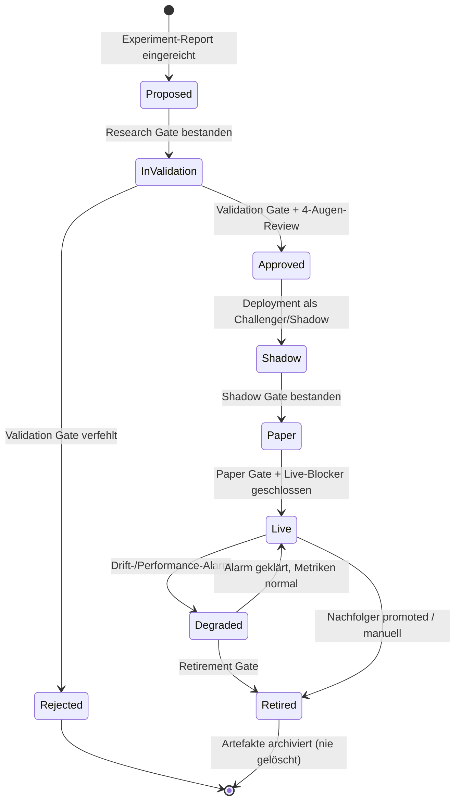

# 11 — ML-Architektur und Model Governance

Zurück: [[00_HOME]] · Verwandt: [[09_RESEARCH_PLATFORM]], [[13_RISK_ENGINE]], [[26_ADR_INDEX]]

## 1. Werkzeugentscheidungen (nur Komponenten mit klarem Nutzen)

| Bedarf | Entscheidung | Begründung / verworfen |
|---|---|---|
| Experiment Tracking + Model Registry | **MLflow** (self-hosted, Postgres-Backend, Artefakte in Object Storage) | ausgereift, API-stabil, Registry mit Stages; verworfen: W&B (SaaS-Datenabfluss), Neptune (Kosten) |
| Dataset-/Feature-Versionierung | **Parquet-Datasets mit Manifest + Hash** ([[08_DATA_CONTRACTS]]); DVC nicht nötig | Datasets sind ohnehin unveränderlich adressiert; DVC/lakeFS = Zusatzkomplexität ohne Mehrwert bei S3-Versionierung |
| Feature Store | **kein Feast** in V1 | Online-/Offline-Skew-Problem existiert kaum: Features werden 1×/Tag batch-berechnet und direkt versioniert; Feast lohnt erst bei Online-Inference |
| Orchestrierung | **Dagster** | asset-orientiert (Daten-Lineage first-class), gute Backfills, lokale Ausführung; verworfen: Airflow (Task-zentriert, schwerer Betrieb), Prefect (schwächere Lineage), Temporal (Overkill für Batch; Execution nutzt eigene State Machine) |
| HPO | **Optuna** mit persistenter Study-DB; Trial-Zähler fließt in DSR ([[09_RESEARCH_PLATFORM]] §4) | Standard, leichtgewichtig |
| Training-Compute | lokal (32-Core-Ryzen; GPU optional für GBM kaum nötig) | Datenvolumen klein (ETF-Panel); Ray erst bei echtem Bedarf |
| CV/Metriken | skfolio (CombinatorialPurgedCV, DSR), eigene astra-metrics | mlfinlab proprietär [LDP-1] |

## 2. Model Lifecycle State Machine

Jeder Übergang erzeugt ein `audit_event` mit Begründung, Verantwortlichem und den
Gate-Metriken. Übergänge nach `Live` erfordern manuelle Freigabe im Operator Control
Plane (kein Auto-Promote).

## 3. Model Registry — Pflichtmetadaten je `model_version`

model_id, version, track, algorithmus, code_version (git SHA), dataset_version,
feature_set (Liste feature_id@version), hyperparams, trainingsfenster, seeds,
CV-Protokoll, Trial-Zähler (für DSR), Metrik-Report-Ref, Kalibrierungsartefakt,
Model Card (Pflichtfelder: Zweck, Annahmen, bekannte Schwächen, Regime-Verhalten,
Abstention-Regeln), Dataset Card, Approval-Historie, Deployment-Historie.

## 4. Champion/Challenger und Shadow

- Je Track genau **ein Champion** (produktiv) und beliebig viele Challenger.
- Challenger laufen im **Shadow Mode**: erhalten dieselben PIT-Inputs, erzeugen
  Predictions + hypothetische Target-Portfolios, die vollständig geloggt, aber nie an
  Risk/Execution weitergegeben werden (technisch erzwungen: nur der Champion-Eintrag in
  `deployments` hat `execution_enabled=true`; der Signal-Service weigert sich, Intents
  aus Nicht-Champion-Predictions zu bauen).
- Promotion Challenger→Champion nur über die Gates aus [[09_RESEARCH_PLATFORM]] §8 +
  manuelle Freigabe; Rollback = Re-Promotion des Vorgängers (Artefakte unveränderlich).

## 5. Drift- und Health-Monitoring (Inputs für Risk-Check R-20 „model health")

| Signal | Methode | Schwelle (initial, [ANNAHME], kalibrieren) |
|---|---|---|
| Feature Drift | PSI je Feature vs Trainingsverteilung, täglich | PSI > 0,25 ⇒ WARN, > 0,5 ⇒ Modell-Degraded |
| Prediction Drift | Verteilung der P-Werte vs Backtest-Verteilung (KS-Test, 60d-Fenster) | p < 0,01 ⇒ WARN |
| Kalibrierung | Brier Score / Reliability rolling 60d vs Erwartung | Verschlechterung > 20 % ⇒ WARN |
| Live-Performance | realisierte vs erwartete Excess-Returns (CUSUM) | CUSUM-Bruch ⇒ Degraded + Review |
| Staleness | Modellalter seit Training | > 12 Monate ⇒ Retraining-Pflichtreview |

`Degraded` setzt automatisch die Exposure-Obergrenze des Tracks auf das 0,5-fache
(Deleveraging-Modus, [[13_RISK_ENGINE]] §5) — kein automatischer Vollausstieg, keine
automatische Liquidation.

## 6. Retraining und Retirement

- Retraining ist **nie automatisch-in-Produktion**: neuer Trainingslauf ⇒ neue
  model_version ⇒ durchläuft denselben Gate-Pfad (verkürzt: bestehende Architektur +
  frisches Fenster = „Refresh-Pfad" mit reduziertem Review, aber vollem Validation Gate).
- Retirement Gate: 60 Tage unter Performance-/Drift-Schwellen oder fachliche
  Obsoleszenz ⇒ Retired; Artefakte und Predictions bleiben 10 Jahre archiviert (Audit).

## 7. Reproduzierbarkeit

Training läuft containerisiert (Digest-gepinnt), Seeds fixiert, Hardware-Nichtdeterminismus
dokumentiert (GBM auf CPU deterministisch konfiguriert; `deterministic=true`,
single-thread wo nötig). Ein Re-Run-Job `astra reproduce <model_version>` muss
byte-identische Modell-Hashes liefern; Abweichung = Blocker für Approval
([[22_TEST_STRATEGY]] T-DET-02).

## 8. LLM-Einsatz (streng begrenzt)

Erlaubt (offline, ohne Handelsautorität): Literatur-/Code-Review-Assistenz,
Incident-Zusammenfassungen, Klassifikation von Anbieter-Changelogs/Statusmeldungen als
Monitoring-Input (mit menschlicher Bestätigung), Generierung von Testfällen.
Verboten: LLM-Output als Feature ohne PIT-/Reproduzierbarkeitsnachweis; LLM als
Entscheider in Signal-, Risk- oder Execution-Pfad. Technische Durchsetzung: die
Produktionsservices haben keinerlei LLM-API-Abhängigkeit (Dependency-Allowlist in CI).
