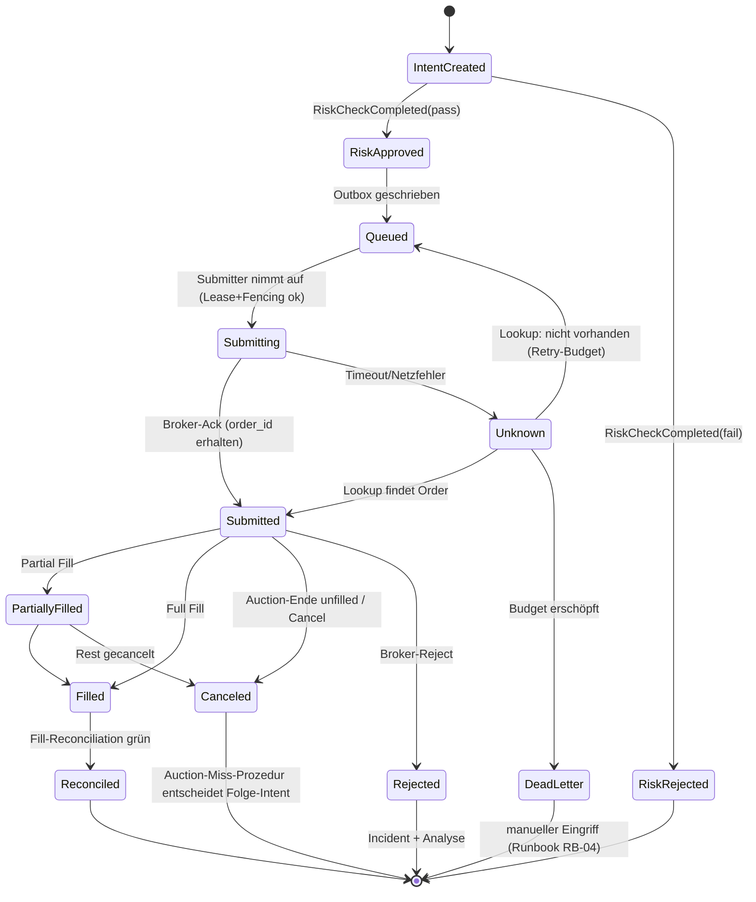

# 15 — Order State Machine, Datenmodelle und Event Contracts

Zurück: [[00_HOME]] · Verwandt: [[14_EXECUTION_ENGINE]], [[16_RECONCILIATION]]

## 1. Order-State-Machine (persistent, crash-sicher)



Zustandsübergänge sind idempotent (Event-Replays ändern nichts), monoton (kein
Rückwärtsgang außer Unknown-Auflösung) und vollständig auditiert. Partial Fills bei
OPG sind selten, aber modelliert: `filled_qty` kumuliert; die Auction-Ende-Regel
entscheidet über den Rest.

## 2. Kern-Datenmodelle (System of Record: PostgreSQL; DDL in `schemas/`)

Notation: PK = Primary Key, UQ = Unique, IDX = Index. Alle Tabellen: `created_at`,
append-only wo angegeben; Änderungen an append-only-Tabellen nur als neue Zeilen.

| Tabelle | Schlüsselfelder | Besonderheiten |
|---|---|---|
| instruments | symbol PK, cusip, figi, asset_class, fractionable, active_from/to | historisierte Stammdaten |
| universes | universe_id PK, track, definition JSONB, version | |
| universe_memberships | (universe_id, symbol, valid_from) PK, valid_to | PIT-Universum ([[05_STRATEGY_TRACK_B]]) |
| market_sessions | (calendar_version, date) PK, session_type, open_ts, close_ts, auction_times | aus exchange_calendars materialisiert |
| raw_data_manifests / bars / quotes / trades | siehe [[08_DATA_CONTRACTS]] | bars partitioniert (Hypertable) |
| corporate_actions | ca_id PK, symbol, type, ex_date, record_date, pay_date, ratio/amount, source, as_of, revision, UQ(symbol,type,ex_date,source,revision) | Zwei-Quellen-Abgleich |
| feature_definitions / dataset_versions | [[09_RESEARCH_PLATFORM]] §3 | |
| experiments | experiment_id PK, dataset_version FK, code_version, config, metrics JSONB, trial_count | MLflow-Spiegel |
| model_versions | model_version_id PK, track, dataset_version FK, artifacts_uri, state, model_card | State Machine [[11_ML_ARCHITECTURE]] §2 |
| predictions | prediction_id PK = uuid5(model_version, decision_date, portfolio), payload JSONB, as_of | append-only |
| target_portfolios | [[12_PORTFOLIO_CONSTRUCTION]] §5 | append-only |
| risk_decisions | decision_id PK, target_portfolio_id FK, check_id, result, inputs JSONB, limits_version | append-only |
| order_intents | intent_id PK (deterministisch), Felder [[14_EXECUTION_ENGINE]] §2, state, fencing_token, UQ(portfolio_id, symbol, decision_date, side) | State-Spalte = SoT der State Machine |
| broker_orders | broker_order_id PK, intent_id FK UQ, client_order_id UQ, alpaca_order_id, status, submitted_at, raw JSONB | Spiegel der Broker-Sicht |
| fills | fill_id PK, broker_order_id FK, qty, price, fees, executed_at, source (stream/rest/manual), UQ(broker_execution_id) | append-only |
| positions | (portfolio_id, symbol, as_of) PK, qty, avg_cost | Snapshot je Reconciliation |
| cash_balances | (portfolio_id, as_of) PK, cash, buying_power | Snapshot |
| broker_ledger / economic_ledger | [[17_DUAL_LEDGER]] §4 | append-only |
| reconciliations | recon_id PK, type, as_of, status, breaks JSONB | [[16_RECONCILIATION]] |
| incidents | incident_id PK, severity, opened_at, source, state, runbook_ref | |
| audit_events | audit_id PK, actor, action, object_ref, payload_hash, prev_hash | **Hash-verkettet, append-only, 10 J. Retention** |
| configuration_versions / deployment_versions | version PK, content_hash, valid_from, approved_by | [[20_INFRASTRUCTURE]] §7 |

Retention: Marktdaten unbegrenzt (Storage billig); operative Tabellen unbegrenzt in
Phase 1–7 (Volumen trivial: ≤ einige tausend Orders/Jahr); Logs/Metrics siehe
[[19_OBSERVABILITY]]; Backups [[21_DISASTER_RECOVERY]].

## 3. Event Contracts

Transport: In Variante A/B **PostgreSQL-Outbox + LISTEN/NOTIFY** statt Kafka
(ADR-005 — ein Message Broker ist bei 1 Entscheidung/Tag/Track nicht gerechtfertigt;
NATS/Redpanda erst in Variante C). Events sind dennoch als versionierte Verträge
definiert (JSON Schema in `data_contracts/events/`), damit der Wechsel auf einen Bus
kontraktkompatibel bleibt.

Gemeinsamer Envelope (Pflicht):

```json
{
  "event_id": "uuid", "event_type": "OrderSubmitted", "event_version": "1.0.0",
  "occurred_at": "2026-08-15T13:25:00.123Z", "recorded_at": "...",
  "correlation_id": "uuid (Entscheidungslauf)", "causation_id": "uuid (Vorgänger-Event)",
  "producer": "execution-engine@1.4.2", "environment": "paper|live|research",
  "schema_version": "1.0.0", "payload_hash": "sha256:...", "payload": { }
}
```

Katalog (je mit eigenem Payload-Schema): MarketDataReceived, MarketDataValidated,
CorporateActionReceived, DatasetPublished, FeatureDatasetPublished, ModelTrained,
ModelApproved, PredictionGenerated, TargetPortfolioGenerated, RiskCheckCompleted,
OrderIntentCreated, OrderSubmitted, OrderAcknowledged, OrderPartiallyFilled,
OrderFilled, OrderCanceled, OrderRejected, ReconciliationCompleted, TradingHalted,
KillSwitchActivated, IncidentOpened.

Beispiel-Payload `OrderFilled@1.0.0`:

```json
{
  "intent_id": "…", "client_order_id": "…", "broker_order_id": "…",
  "symbol": "SPY", "side": "buy", "filled_qty": 12, "avg_price": "642.310000",
  "fees": "0.00", "auction": true, "official_open_price": "642.300000",
  "slippage_bps": 0.16, "executed_at": "2026-08-17T13:30:01.250Z",
  "portfolio_id": "track_a_paper", "fencing_token": 42
}
```

Regeln: Preise/Geldbeträge als Dezimal-Strings (nie Float), Events unveränderlich,
Konsumenten idempotent (Dedup über event_id), Schema-Evolution nur additiv innerhalb
einer Major-Version (Contract-Tests, [[22_TEST_STRATEGY]]).

## 4. APIs (interne Service-Verträge, REST/JSON, Auth via mTLS + Token)

| Service | Kern-Endpunkte | Idempotenz/Fehler |
|---|---|---|
| Strategy | `POST /v1/predictions:generate {track, decision_date}` → prediction_id | deterministisch: gleicher Input ⇒ gleiche ID; 409 bei laufendem Lauf |
| Portfolio | `POST /v1/target-portfolios:build {prediction_id}` | dito |
| Risk | `POST /v1/risk:evaluate {target_portfolio_id}` → decisions + intents(pending→approved/rejected) | einzige Instanz, die approval_state schreibt |
| Execution | `POST /v1/execution:submit {portfolio_id, auction_date}`; `POST /v1/execution:cancel {intent_id}` | verlangt gültiges Fencing Token; 423 wenn nicht Leader |
| Broker Adapter | intern (BrokerPort), kein Netz-API | |
| Reconciliation | `POST /v1/recon:run {type, as_of}`; `GET /v1/recon/{id}` | idempotent je (type, as_of) |
| Operator Control Plane | `GET /v1/state`; `POST /v1/kill-switch {scope, reason, confirm_code}`; `POST /v1/mode {halt|deleverage|normal}`; `POST /v1/intents/{id}:approve` (falls manuelle Freigabe konfiguriert); `POST /v1/liquidation:start` (4-Augen: zweiter Bestätigungscode) | jede Mutation = Audit Event; Fehlercodes: 401/403, 409 (Zustandskonflikt), 423 (Lease), 428 (Bestätigung fehlt) |
