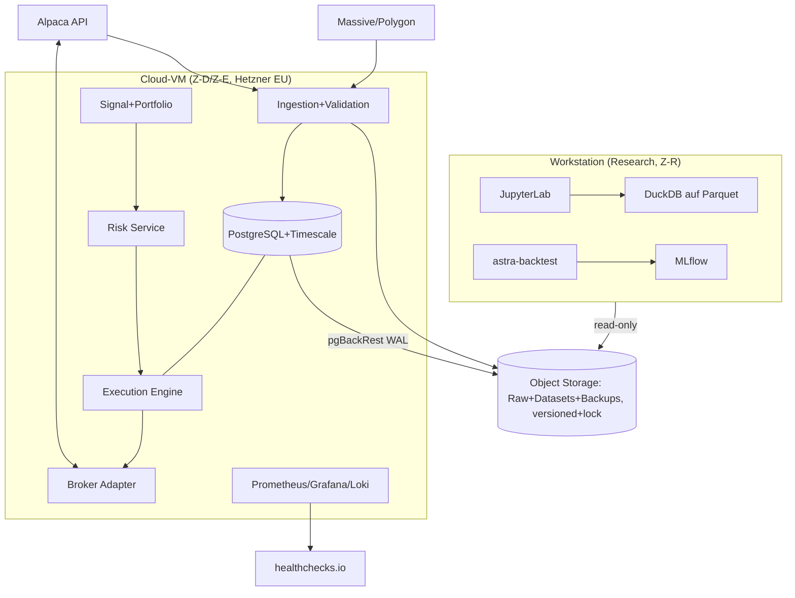

# 20 — Infrastruktur: Varianten A/B/C, Deployment, Repository, Konfiguration

Zurück: [[00_HOME]] · Verwandt: [[18_SECURITY]], [[21_DISASTER_RECOVERY]], [[24_COST_MODEL]]

## 1. Gemeinsame Basis (alle Varianten)

Sprache: **Python 3.12+** (ADR-000; Typing strikt, mypy; Rust-Erweiterungen nur bei
nachgewiesenem Bedarf). Containerisierung: Docker + Compose (A/B), Kubernetes erst C
(ADR-012 — kein K8s für 5 Container). Deployment: GitHub Actions CI → signierte Images
→ manuelles, checklistenbasiertes Deploy-Fenster (nie zwischen 08:00–10:00 ET).
Datenbanken: **PostgreSQL 16 (operativ) + TimescaleDB-Extension (Bars)**; **DuckDB**
für Research-Analytik direkt auf Parquet; ClickHouse erst bei > ~1 TB heißen Daten
(ADR-007). Objektspeicher: MinIO lokal (A) / Cloud S3-kompatibel mit Versioning +
Object Lock (B/C). Kein Kafka/NATS bis Variante C (ADR-005, [[15_ORDER_STATE_MACHINE]] §3).

Ressourcen-Trennung: **Training/Backtesting** (bursty, CPU-lastig) läuft auf der
Workstation; **Live/Paper-Entscheidung+Execution** (klein, aber verfügbarkeitskritisch)
läuft auf dediziertem Kleinsystem/VM — nie auf derselben Maschine wie Research-Last
(Variante B/C; in A nur durch Container-Quotas getrennt, akzeptierte Schwäche).

## 2. Variante A — Bootstrap (vorhandene Hardware)

- **Hardware:** vorhandener Ryzen 32-Core/32 GB/RTX 2080; 2×512-GB-SSD als ZFS-Mirror
  für DB+Raw-Archiv (Kapazitätsgrenze!), 1×512 GB System. USV dringend empfohlen (~150 €).
- **Rollen:** alles auf einer Maschine (Research, Daten, Paper-Execution) in getrennten
  Docker-Netzen; Cloud nur: Backup-Bucket (Backblaze B2/Hetzner, ~5 €/M) + healthchecks.io.
- **Speicherbedarf:** Minute-Bars 12 ETFs × 20 J. ≈ 15–25 GB Parquet komprimiert;
  Whole-Market-Minute-Flat-Files (falls Massive-Bulk gezogen wird) 1–3 TB ⇒ **nicht**
  lokal in A halten; nur Universum + SPY-Kontext laden. RAM 32 GB ausreichend
  (TimescaleDB 8 GB, Rest Jobs). GPU: für V1-Modelle unnötig.
- **Kosten:** einmalig ~150–400 € (USV, ggf. 2-TB-SSD ~100 €); laufend ~10–15 €/M
  (Backup, Monitoring) + Datenpläne ([[24_COST_MODEL]]).
- **Grenzen/Risiken:** kein Hardware-Failover, Wohnungs-Internet/Strom = SPOF,
  Research-Last kann Paper-Betrieb stören. **Geeignet bis einschließlich Phase 6
  (Shadow), nicht für Live.**
- **Migration → B:** Execution-Stack (Compose-Projekt + Postgres-Dump) auf VM umziehen;
  Architektur ist identisch, nur Platzierung ändert sich.

## 3. Variante B — Professional Personal-Capital (Live-fähig)

- **Execution-Host:** kleine Cloud-VM (z.B. Hetzner CX32/CPX31: 4 vCPU, 8–16 GB RAM,
  80–160 GB NVMe, EU-Rechenzentrum, ~8–15 €/M) für Z-E + Z-D-Live-Anteil: Postgres,
  Ingestion-Light (Live-Stream), Risk/Execution, Monitoring-Agent. Alternativ
  US-Region (geringere Latenz zu Alpaca) — für Daily-Auktion irrelevant, EU-Datennähe
  gewinnt [ENTSCHEIDUNG: EU].
- **Research bleibt lokal** (Ryzen) mit read-only Zugriff auf Datasets im Object Storage.
- **Redundanz:** tägliche Postgres-Basebackups + WAL-Archivierung (pgBackRest) nach S3
  (RPO ≤ 15 min); Object Storage mit Versioning+Lock; zweite Region als Backup-Ziel.
  Kein Hot-Standby (bewusst: fail-closed „nicht handeln" ist akzeptabler Zustand,
  [[21_DISASTER_RECOVERY]] §2).
- **Monitoring:** Prometheus/Grafana/Loki auf der VM oder zweiter Mini-VM (~5 €/M);
  externer Dead-Man.
- **Kosten:** einmalig ~0–300 € (Setup); laufend ~25–45 €/M Infrastruktur + 178 €/M
  Daten (Massive Developer 79 $ + Alpaca ATP 99 $) ⇒ Gesamt ≈ **200–250 €/M**.
- **Grenzen:** Single-VM-Ausfall ⇒ RTO 4 h (Neu-Provisionierung via IaC + Restore);
  akzeptiert, weil Safe State = keine Orders.
- **Migration → C:** IaC (Terraform/Ansible ab B Pflicht) macht Region-/Provider-Wechsel
  und Verdopplung mechanisch.

## 4. Variante C — Institutional Target State

- Getrennte Accounts/VPCs für Research/Staging/Prod; K8s oder ECS; Postgres als
  Managed-HA (Multi-AZ), Timescale/ClickHouse-Cluster; NATS/Redpanda als Bus;
  Vault + KMS; SIEM; 2 Regionen aktiv/passiv (DR-Region mit warmem Standby,
  RTO < 30 min, RPO < 5 min); formalisierte Change-/Release-Governance (4-Augen
  überall), 24/7-Bereitschaft. Kosten grob **1.500–5.000 €/M** zzgl. Professional-
  Market-Data-Lizenzen — erst relevant bei externem Kapital/Team; kein Bestandteil
  der aktuellen Planung, aber Migrationspfad dokumentiert (IaC, Event-Contracts,
  Port/Adapter machen den Umzug zu Platzierungs-, nicht Redesign-Arbeit).

## 5. Deployment-Diagramm (Variante B)



## 6. Repository-Struktur (ADR-011: **Monorepo**)

```
astratrade/
├── services/            # ingestion, validation, signal, portfolio, risk,
│                        # execution, broker-adapter, reconciliation, control-plane
├── libraries/           # astra-core (Typen/IDs), astra-backtest, astra-metrics,
│                        # astra-data (PIT-Zugriff), astra-contracts (Event/Config-Schemas)
├── strategies/          # track_a/, track_b/, track_c/ (Signal-Definitionen, Configs)
├── research/            # Notebooks, Experiment-Reports (zitierfähig nur mit Versionen)
├── data_contracts/      # JSON-Schemas: Events, Manifeste
├── schemas/             # SQL-DDL + Migrationen (alembic/sqitch)
├── infra/               # Terraform/Ansible
├── deploy/              # Compose-Profile (research/paper/live), Release-Checklisten
├── config/              # typisierte Configs je Env (siehe §7)
├── migrations/          # DB-Migrationsskripte (verlinkt aus schemas/)
├── monitoring/          # Dashboards, Alert-Rules, SLOs
├── runbooks/            # RB-01…, siehe 28_RUNBOOKS
├── tests/               # unit/property/integration/e2e/chaos (Struktur 22_TEST_STRATEGY)
└── docs/                # dieses Vault
```

Begründung Monorepo: ein Entwickler, atomare Änderungen über Contract+Service+Test,
eine CI-Pipeline, ein Versionsstand je Deployment (`deployment_versions` referenziert
genau einen Monorepo-SHA). Multi-Repo verworfen: Koordinationskosten ohne Nutzen bei
dieser Teamgröße; Neubewertung bei > 4 Entwicklern.

## 7. Konfigurationsmanagement

- **Typisiert:** Pydantic-Modelle in `astra-contracts`; YAML-Dateien je Domäne:
  `environment.yaml`, `data_feeds.yaml`, `universes/{track}.yaml`,
  `strategies/{track}.yaml`, `features/{track}.yaml`, `models/{track}.yaml`,
  `portfolio_constraints/{track}.yaml`, `risk_limits/{track}.yaml`,
  `execution.yaml`, `broker.yaml`, `monitoring.yaml`, `emergency.yaml`.
- **Versioniert + auditierbar:** Configs liegen im Repo; beim Deploy wird der
  validierte, zusammengeführte Config-Baum gehasht und als `configuration_versions`-
  Zeile registriert; jede Entscheidung referenziert diese Version.
- **Validierung:** Schema + Cross-Checks (z.B. Risk-Limits konsistent mit Track-
  Constraints) beim Start; **ungültige oder unvollständige Live-Config ⇒ kein
  Handelsstart** (R-01); Änderung von `risk_limits`/`emergency` verlangt 4-Augen-
  Bestätigung im Control Plane.
