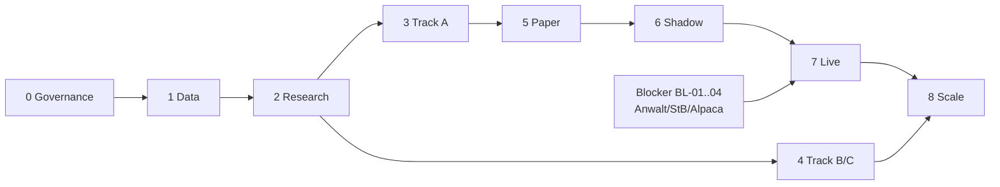

# 23 — Implementierungs-Roadmap

Zurück: [[00_HOME]] · Verwandt: [[24_COST_MODEL]], [[25_TEAM_AND_SKILLS]]

Aufwände in Personentagen (PT) für einen erfahrenen Entwickler mit Quant-Grundwissen
[ANNAHME]; Kalenderzeit bei Teilzeit entsprechend länger. Kosten = Infrastruktur/Daten
gemäß [[24_COST_MODEL]].

| Phase | Ziele & Kern-Deliverables | Abhängig von | PT | Exit-Kriterien (Definition of Done) |
|---|---|---|---|---|
| **0 Governance & Spezifikation** | Begriffe/Anforderungen fixiert (dieses Vault), ADRs beschlossen, Data Contracts + Event-Schemas v1, Threat Model, Lockbox definiert & committed, Repo-Skeleton + CI | — | 8–12 | ADR-000..018 approved; lockbox.yaml committed; CI grün auf Skeleton; Blocker BL-01..04 an Anwalt/StB delegiert |
| **1 Data Foundation** | Ingestion Massive (Flat-File-Backfill Daily+Minute für 13 Symbole + Benchmarks) & Alpaca; Raw Archive; Manifeste; Normalisierung; Validierungs-Checks; CA-Pipeline (2 Quellen); exchange_calendars; ALFRED/Treasury-Ingestion; Lineage-CLI | 0 | 20–30 | Backfill vollständig (Gap-Report < 0,1 %); Cross-Source-Diff-Job läuft täglich grün; T-LEAK-02/03 grün; Restore-Test des Archivs erfolgreich |
| **2 Research Platform** | Dataset Builder (PIT/bitemporal), Feature Registry, astra-backtest inkl. Golden-Dataset-Tests, astra-metrics (+skfolio-Integration), MLflow, Leakage-Testsuite, Zweit-Engine-Cross-Check | 1 | 25–35 | Golden Tests von Hand verifiziert; Determinismus-Hash stabil über 2 Maschinen; B0/B1-Baselines reproduzierbar mit Report |
| **3 Track A komplett** | Features, Baseline-Leiter B1–B3, M1/M2, Walk-Forward, DSR/PBO-Auswertung, Portfolio Construction + Constraints, Research-+Validation-Gate-Report | 2 | 25–40 | Gates aus [[09_RESEARCH_PLATFORM]] §8 formal durchlaufen (Ergebnis kann auch „nur B3 geht weiter" sein — ein ehrliches Negativergebnis ist ein gültiger Exit) |
| **4 Track B & C** | analog Track A, eigene Benchmarks (EW-Sektor-Index, 60/40), eigene Gates | 2 (parallel zu 3 möglich) | 20–30 | dito je Track |
| **5 Paper-Trading-System** | Signal-/Portfolio-/Risk-/Execution-Services, Outbox+State Machine, Alpaca-Paper-Adapter, Dual Ledger, Reconciliation, Control Plane v1, Monitoring/Alerts, Runbooks RB-01..08; empirische Alpaca-Tests (opg-Fills, client_order_id-Duplikate, Partial-Fill-Verhalten) | 3 | 35–50 | 20 Handelstage fehlerfreier Paper-Vollzyklus; alle Sev-1-Alerts + Kill-Switch gedrillt; Broker-Sandbox-Testsuite nächtlich grün |
| **6 Shadow Mode** | Live-Datenpfad (ATP-Feed), Entscheidungen in Echtzeit ohne Orders, Hash-Vergleich online vs offline, Paper parallel | 5 | 5–10 | 20 Tage Hash-Gleichheit online/offline; Slippage-/Fill-Messung Paper vs offizieller Auktionspreis dokumentiert |
| **7 Controlled Live** | Live-Konto, Kapital 10–25k USD [AS-01], harte Limits (Order-Notional ≤ 5k, nur Track A), tägliche manuelle Reconciliation-Bestätigung, Variante-B-Infrastruktur | 6 + BL-01..04 geschlossen | 5–8 Setup | 60 Handelstage: 0 ungeklärte Breaks, realisierte Slippage < Modell+50 %, alle SLOs eingehalten |
| **8 Scale-up** | Kapital max ×2 je Schritt, Tracks B/C live nach eigenen Gates, Review-Zyklus formalisiert (monatlich Performance, quartalsweise Modell/Risk) | 7 | laufend | Scale-up Gate je Schritt ([[09_RESEARCH_PLATFORM]] §8) |

**Gesamtaufwand bis Ende Phase 5: ~115–170 PT** (bei 2 Tagen/Woche ≈ 12–18 Monate;
Vollzeit ≈ 6–8 Monate). Kritischer Pfad: 0 → 1 → 2 → 3 → 5 → 6 → 7 (Track B/C sind
nicht kritisch). Größtes Schedule-Risiko: Phase 3 liefert kein Gate-fähiges Modell ⇒
dann geht B3 (regelbasiert) in Phase 5 — das System ist bewusst auch mit
Baseline-Strategien betreibbar.

## Abhängigkeitsdiagramm

## 10. MVP-Abgrenzung

**Im MVP (Ende Phase 5):** Track A (ggf. als B3-Baseline), Paper-Trading-Vollzyklus,
Dual Ledger, Reconciliation, Kill Switches, Monitoring, Runbooks.
**Bewusst NICHT im MVP:** Track-Kombinations-Layer, Live-Kapital, Databento/Norgate,
Feast/Kafka/K8s, Fundamentals/News/NLP, Optionsdaten, Intraday-Signale, Multi-Broker,
automatisches Retraining, Web-Dashboards jenseits Grafana + einfachem Control Plane.
Begründung jeweils: kein Beitrag zum Nachweis des Kernwertversprechens (sicherer,
reproduzierbarer Entscheidungspfad + ehrliche Strategievalidierung).

## Nächste 20 konkrete Arbeitsschritte

1. ADR-Review: ADR-000..018 lesen/beschließen ([[26_ADR_INDEX]]).
2. Anwalts-/StB-Mandat für BL-01/BL-04 bzw. BL-01-Steuerfragen erteilen.
3. Alpaca-Konto (Paper) eröffnen; Onboarding-Realität für DE dokumentieren (BL-03).
4. Massive-Account Developer-Plan; ToS/Storage-Klauseln archivieren (Ledger-Update).
5. Monorepo-Skeleton + CI (Lint, mypy, pytest, gitleaks) aufsetzen.
6. `lockbox.yaml` definieren und committen (Zeiträume + Seed, [[09_RESEARCH_PLATFORM]] §7).
7. Postgres+Timescale+MinIO via Compose provisionieren; Schemas v1 migrieren.
8. exchange_calendars integrieren; market_sessions materialisieren; T-CAL-01/T-TZ-01 schreiben.
9. Massive-Flat-File-Backfill Daily-Bars (13 Symbole + SPY/BIL-Historie) mit Manifesten.
10. Minute-Bar-Backfill Universum; Gap-/Duplicate-Statistiken auswerten.
11. Corporate-Actions-Ingestion Massive + Alpaca; Diff-Abgleich; T-CA-01.
12. ALFRED-Vintage- und Treasury-Ingestion.
13. Cross-Source-Daily-Diff-Job + Alert einrichten.
14. Dataset Builder mit as-of-Join + T-LEAK-01..05.
15. astra-backtest: Accounting-Kern + Golden-Dataset-Handrechnung.
16. astra-metrics + skfolio-Integration; Report-Template.
17. B0/B1 (SPY, 200d-Regel) End-to-End reproduzierbar; Determinismus-Hash in CI.
18. B2/B3 implementieren; Walk-Forward-Harness; Kosten-Stress-Matrix.
19. MLflow aufsetzen; Experiment-Report-Pflichtfelder erzwingen.
20. Threat-Model-Workshop-Dokument finalisieren + Security-CI (Trivy, pip-audit) aktivieren.
